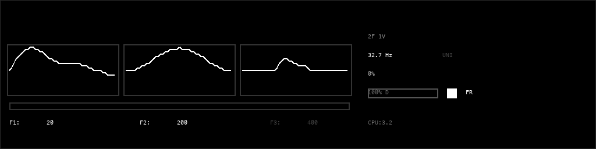

# Spaluter — Pulsar Synthesis for disting NT

A [pulsar synthesis](https://en.wikipedia.org/wiki/Pulsar_synthesis) instrument plugin for the [Expert Sleepers disting NT](https://expert-sleepers.co.uk/distingNT.html) Eurorack module.

[](https://youtu.be/JfdUQbmtTNU)

## What Is Pulsar Synthesis?

### Short Version

Pulsar synthesis builds sound from tiny snippets of a waveform called pulsarets. Think of it like a strobe light — but instead of flashes of light, you're hearing quick bursts of a waveform, repeating over and over.

The speed of that repetition sets the pitch. Speed it up, you get a higher note. Slow it down, lower.

Now, each burst doesn't have to fill the entire space before the next one. You can make it shorter, leaving a gap of silence in between. That's the duty cycle — and adjusting it dramatically changes the character of the sound, from full and warm to thin and buzzy.

On top of that, you can shape the tone with formants. Formants are what make your voice sound like "ah" versus "ee" — they're resonant peaks that give a sound its vowel-like quality. Pulsar synthesis lets you dial those in directly, so you can make the sound brighter, darker, or almost vocal.

You can also tell certain pulses to skip — randomly, or in patterns — which adds texture and grit, like the sound is breaking apart at the edges.

What makes this powerful is that you get the stability of a traditional oscillator — solid pitch, predictable behavior — but with a huge range of timbral control on top. It can go from clean organ tones to alien vocal pads to glitchy rhythmic textures, all from the same core engine.

### Longer Version

Pulsar synthesis is a technique developed by [Curtis Roads](https://www.curtisroads.net/) and Alberto de Campo in the early 2000s, described in Roads' book [*Microsound*](https://mitpress.mit.edu/9780262681544/microsound/) (MIT Press, 2001). It belongs to the family of granular and particle-based synthesis methods that operate on the *micro-timescale* of sound — durations below about 100 milliseconds, where individual sonic events blur into continuous tones and textures.

### Core Concept

A **pulsar** is a brief burst of sound (a **pulsaret**) shaped by an amplitude envelope (a **window function**), repeated at a controllable fundamental frequency. The train of pulsars creates a pitched tone whose timbre is determined by three factors:

1. **The pulsaret waveform** — the waveshape inside each pulse (sine, saw, formant-like shapes, noise, etc.)
2. **The window function** — the amplitude envelope applied to each pulsaret (Hann, Gaussian, exponential decay, etc.)
3. **The duty cycle** — what fraction of each fundamental period contains active sound vs. silence

When the duty cycle is 100%, every period is filled with sound and the result resembles classic wavetable synthesis. As the duty cycle decreases, the pulsaret is centered in the period with equal silence gaps before and after, creating a characteristic hollow, buzzing, or clicking quality. At very low duty cycles, the individual pulsarets become audible as distinct sonic particles.

### Formants and Spectral Shaping

A key feature of pulsar synthesis is **formant control**. The pulsaret waveform can cycle at a frequency independent of the fundamental, creating fixed spectral peaks (formants) similar to vowel sounds in speech. By setting formant frequencies to values like 200 Hz, 800 Hz, or 2000 Hz, you can sculpt vowel-like resonances that remain constant as the fundamental pitch changes — just as human vocal formants stay roughly fixed regardless of the pitch being spoken or sung.

This plugin extends the original technique with up to **3 independent formant oscillators**, each with its own frequency, stereo pan position, and CV input. The formants sum together before the envelope and output stages, enabling rich spectral structures that evolve under voltage control.

### Masking

Roads also introduced **masking** — selectively muting pulses within the train to create rhythmic or stochastic textures. In *stochastic masking*, each pulse has a random probability of being silenced, producing granular, cloud-like dissolution of the tone. In *burst masking*, a repeating on/off pattern (e.g., 4 pulses on, 2 off) creates metrically structured rhythms at the micro-timescale.

### Further Reading

- Curtis Roads, [*Microsound*](https://mitpress.mit.edu/9780262681544/microsound/) (MIT Press, 2001) — the definitive reference
- Curtis Roads, ["Sound Composition with Pulsars"](https://doi.org/10.2307/3681778), *Journal of the Audio Engineering Society*, 2001
- [Wikipedia: Pulsar Synthesis](https://en.wikipedia.org/wiki/Pulsar_synthesis)
- Curtis Roads, [*The Computer Music Tutorial*](https://mitpress.mit.edu/9780262680820/the-computer-music-tutorial/) (MIT Press, 1996) — broader context on granular and particle synthesis
- Alberto de Campo, [*Microsound*](https://www.albertodecampo.at/) — de Campo's related work on implementations

## Features

- **10 pulsaret waveforms** — sine, sine×2, sine×3, sinc, triangle, saw, square, formant, pulse, noise — with continuous morphing between adjacent shapes
- **5 window functions** — rectangular, Gaussian, Hann, exponential decay, linear decay — with continuous morphing
- **1–3 parallel formants** with independent frequency control, per-formant CV modulation, and constant-power stereo panning
- **Masking** — stochastic (probability-based) and burst (on/off pattern) modes for rhythmic textures, with optional per-formant independent masking for richer spectral variation
- **Amplitude jitter** — per-pulse random gain reduction (0–100%) for organic variation, from subtle inconsistency to fragile, unpredictable textures
- **Timing jitter** — per-pulse random period variation (0–100%) for analog-like pitch drift; with multiple voices in unison, each drifts independently for natural chorus effects
- **Glisson** — per-pulse micro-glissando sweeps pitch within each pulsaret (±2 octaves), from subtle shimmer to dramatic laser chirps
- **Formant frequency tracking** — scales formant frequencies with voice pitch, preserving spectral shape across the keyboard instead of the default fixed-formant behavior
- **1–4 voice polyphony** — three modes: MIDI chords with voice stealing, Free Run interval stacking with 14 chord types, or CV trigger+pitch triggering with overlapping releases
- **14 chord types** — Unison, Octaves, Fifths, Sub+Oct, Major, Minor, Maj7, Min7, Sus4, Dom7, Dim, Aug, Power, Open5th — for Free Run interval stacking
- **CV mode** (default) — Rings-style polyphonic triggering from a single trigger+pitch CV pair: each rising edge allocates a new voice while previous voices ring out through their release envelopes with frozen parameters, so only the newest voice responds to knob/CV changes
- **Free Run mode** — generates sound immediately without MIDI; pitch set by Base Pitch parameter + Pitch CV; per-pulse AR envelope retriggers on every pulse
- **Per-pulse AR envelope** in Free Run mode (retriggers each pulse, release at period midpoint); standard ASR in MIDI and CV modes
- **15 bipolar CV inputs** — pitch (1V/oct), trigger, duty, mask, pulsaret morph, window morph, formant 1/2/3 Hz, attack, release, glisson — first 12 inputs assigned by default; amplitude, pan, amp jitter, timing jitter CVs default to none
- **Sub-octave output** — stereo octave-down via analog-style frequency divider, routable to any bus for layering a sub one octave below the fundamental
- **Aux outputs** — pulse trigger, envelope follower, and pre-clip stereo taps — all bus-routable, disabled by default
- **Sample-based pulsarets** — load WAV files from SD card as custom pulsaret waveforms with adjustable playback rate
- **Centered duty cycle** — active pulsaret is centered in the period with equal silence gaps before and after, producing symmetrical spectral sidebands
- **Real-time display** — three separate waveform views (pulsaret, window, duty cycle), formant Hz readouts, amplitude %, drive %, envelope bar, frequency readout, trigger indicator, peak output meter

## Parameters

66 parameters across 15 pages, organized into 9 groups:

| Page | Parameter | Range | Default |
|------|-----------|-------|---------|
| **Mode** | Gate Mode | MIDI / Free Run / CV | CV |
| | Voice Count | 1–4 | 1 |
| | Chord Type | 14 types (see Polyphony section) | Unison |
| | MIDI Ch | 1–16 | 1 |
| | Base Pitch | MIDI note 0–127 | C1 (24) |
| **Level** | Amplitude | 0–200% | 100% |
| | Drive | 100–400% | 100% |
| | Attack | 0.1–2000 ms | 10 ms |
| | Release | 1.0–3200 ms | 200 ms |
| | Glide | 0–2000 ms | 0 ms |
| **Waveform** | Pulsaret | 0.0–9.0 | 2.5 |
| | Window | 0.0–4.0 | 0.5 |
| | Duty Cycle | 1–100% | 50% |
| | Duty Mode | Manual / Formant | Manual |
| **Formants** | Formant Count | 1–3 | 2 |
| | Formant 1 Hz | 20–2000 Hz | 20 Hz |
| | Formant 2 Hz | 20–2000 Hz | 200 Hz |
| | Formant 3 Hz | 20–2000 Hz | 400 Hz |
| | Formant Track | Fixed / Track | Fixed |
| **Texture** | Mask Mode | Off / Stochastic / Burst | Off |
| | Mask Amount | 0–100% | 50% |
| | Burst On | 1–16 | 4 |
| | Burst Off | 0–16 | 4 |
| | Indep Mask | Off / On | Off |
| **Texture** | Amp Jitter | 0–100% | 0% |
| | Time Jitter | 0–100% | 0% |
| | Glisson | -10.0 to +10.0 | 0 |
| **Panning** | Pan 1 | -100 to +100 | 0 |
| | Pan 2 | -100 to +100 | -50 |
| | Pan 3 | -100 to +100 | +50 |
| **Sample** | Use Sample | Off / On | Off |
| | Folder | (SD card) | — |
| | File | (SD card) | — |
| | Sample Rate | 25–400% | 100% |
| **Outputs** | Output L | Bus 1–64 | Bus 13 |
| | Output R | Bus 1–64 | Bus 14 |
| **Aux Out** | Trig Out | Bus 0–64 | 0 (none) |
| | Env Out | Bus 0–64 | 0 (none) |
| | Pre-clip L | Bus 0–64 | 0 (none) |
| | Pre-clip R | Bus 0–64 | 0 (none) |
| | Oct Down L | Bus 0–64 | 0 (none) |
| | Oct Down R | Bus 0–64 | 0 (none) |
| **CV Inputs** | *(see CV table below — 15 inputs across 5 pages)* | | |

Unused parameters are automatically grayed out based on context (e.g., Formant 2/3 Hz when count is 1, Burst parameters when mask mode is not Burst, Indep Mask when masking is off, Chord Type in MIDI/CV mode, Voice Count in CV mode).

## CV Inputs

All CV inputs are **bipolar** (±5V). Each is routable to any of the 64 buses (1–12 inputs, 13–20 outputs, 21–64 aux), or 0 for none.

| CV Input | Default Bus | Scaling | Effect |
|----------|-------------|---------|--------|
| Pitch CV | Input 1 | 1V/oct exponential | Per-sample pitch modulation |
| Trigger CV | Input 2 | >2.5V = high | Trigger input for CV mode voice allocation |
| Duty CV | Input 3 | ±5V → ±20% offset | Duty cycle offset added to base |
| Mask CV | Input 4 | ±5V → ±50% offset | Mask amount offset (bipolar) |
| Pulsaret CV | Input 5 | ±5V → full range | Sweeps pulsaret morph ±4.5 |
| Window CV | Input 6 | ±5V → full range | Sweeps window morph ±2.0 |
| Formant 1 CV | Input 7 | ±5V → ±1000 Hz | Formant 1 frequency offset |
| Formant 2 CV | Input 8 | ±5V → ±1000 Hz | Formant 2 frequency offset |
| Formant 3 CV | Input 9 | ±5V → ±1000 Hz | Formant 3 frequency offset |
| Attack CV | Input 10 | ±5V → ±1000 ms | Envelope attack time offset |
| Release CV | Input 11 | ±5V → ±1600 ms | Envelope release time offset |
| Glisson CV | Input 12 | ±5V → ±2.0 oct | Glisson depth offset |
| Amplitude CV | 0 (none) | ±5V → ±50% offset | Amplitude offset added to base |
| Pan 1 CV | 0 (none) | ±5V → ±100% offset | Formant 1 stereo pan position |
| Amp Jit CV | 0 (none) | ±5V → ±50% offset | Amp jitter amount offset |
| Time Jit CV | 0 (none) | ±5V → ±50% offset | Timing jitter amount offset |

CV modulation is applied as an offset on top of the parameter's base value (set by knob or parameter page). All CVs except Pitch are block-rate averaged. Pitch CV is processed per-sample for accurate 1V/oct tracking.

## Signal Chain

```
Pitch Source:
  MIDI mode:    MIDI note + Pitch CV
  Free Run:     Base Pitch × Chord Ratio + Pitch CV
  CV mode:      Base Pitch × Pitch CV (captured per voice at trigger)

→ Frequency (with glide)
→ For each voice (1–4):
    Master Phase Oscillator × Timing Jitter
    → Pulse Trigger → Mask Decision (stochastic/burst, optionally per-formant)
    → Amp Jitter (random gain per pulse)
    → For each formant (1–3):
        Formant Hz (× pitch ratio if Formant Track)
        Pulsaret (table morph or sample) × Glisson × Window (table morph) × Mask
        → Constant-power pan → Stereo accumulate
    → Normalize → Envelope × Velocity × Amplitude × Amp Jitter
       (per-pulse AR in Free Run; ASR in MIDI and CV modes)
    → DC-blocking highpass
→ Sum voices → Normalize by voice count → Drive (1–4× gain)
→ [Pre-clip L/R tap] → Soft clip (Padé tanh)
→ Output L/R
→ [Oct Down L/R: Output through frequency divider → sub-octave]
→ [Trigger Out: 1.0 on voice 0 pulse, else 0.0]
→ [Env Out: max envelope across all voices]
```

## CV Mode (Rings-style Voice Triggering)

Polyphonic voice triggering from a single trigger+pitch CV pair, inspired by Mutable Instruments Rings. Each trigger rising edge allocates a new voice while previous voices ring out through their release envelopes — up to 4 simultaneous voices.

### Setup

1. Set **Gate Mode** to **CV** (Mode page) — this is the default
2. Patch a trigger/gate signal into **Input 2** (Trigger CV, default bus)
3. Patch a 1V/oct pitch source into **Input 1** (Pitch CV, default bus)
4. Adjust **Attack**/**Release** on the Level page — Amplitude defaults to 100%

### Behavior

| Trigger state | What happens |
|---|---|
| **Rising edge** | Allocates a voice, captures pitch from Base Pitch × Pitch CV, starts attack |
| **Held high** | Active voice tracks Pitch CV in real time (pitch bends) |
| **Falling edge** | Active voice enters release; pitch and all synthesis parameters freeze |
| **During release** | Voice sounds independently — knob/CV changes only affect the next triggered voice |

When all 4 voices are releasing, a new trigger steals the quietest (lowest envelope) voice.

### Grayed-out parameters

**Voice Count**, **Chord Type**, and **MIDI Ch** are not used in CV mode and are automatically grayed out.

## Installation

A pre-built binary is included in the repository — no toolchain required.

1. Download [`plugins/spaluter.o`](plugins/spaluter.o) from this repository (or clone the repo)
2. Remove the flash drive from your disting NT
3. Plug the flash drive into your computer
4. Copy `spaluter.o` to the `programs/plug-ins` folder on the flash drive
5. Eject the flash drive from your computer
6. Plug the flash drive back into the disting NT
7. Restart the module

Spaluter should now appear as an available plugin to load.

## Getting Sound

Spaluter defaults to CV mode at 100% amplitude — patch a trigger and pitch to start playing immediately.

### Option A: Use CV inputs (recommended)

Spaluter is designed to be played via CV. At minimum, patch into:

1. **Input 1** (Pitch CV) — a 1V/oct pitch source (sequencer, keyboard, etc.) controls the fundamental frequency
2. **Input 2** (Trigger CV) — a gate/trigger signal to trigger voices

With just these two patched, each trigger allocates a voice at the current pitch. The other 10 default CV inputs add further modulation when patched.

### Option B: Switch to Free Run mode

If you want sound without any CV patched:

1. Navigate to the **Mode** page
2. Switch **Gate Mode** to **Free Run**
3. Sound will begin immediately at the default pitch (C1, ~32.7 Hz)
4. Adjust **Base Pitch** on the **Mode** page to change the fundamental frequency

## Building from Source

If you want to modify the plugin and rebuild:

### Requirements

- ARM GCC toolchain (`arm-none-eabi-c++`)
- [disting NT API](https://expert-sleepers.co.uk/distingNTSDK.html) (included as submodule)

### Build

```sh
git clone --recursive https://github.com/sroons/spaluter.git
cd spaluter
make
```

This produces `plugins/spaluter.o`.

## Hardware Controls

Encoders and buttons not listed below keep their standard disting NT behavior.

### Pots

| Pot | Parameter | Range |
|-----|-----------|-------|
| Left | Pulsaret morph | 0.0–9.0 (sweeps all 10 waveforms) |
| Centre | Duty Cycle | 1–100% |
| Right | Window morph | 0.0–4.0 (sweeps all 5 windows) |

### Buttons

| Button | Action |
|--------|--------|
| Left encoder button | Cycle mask mode: Off → Stochastic → Burst → Off |
| Right encoder button | Cycle formant count: 1 → 2 → 3 → 1 |
| Button 3 | Cycle voice count: 1 → 2 → 3 → 4 → 1 |
| Button 4 | Cycle chord type (14 options) |

### Outputs

Output L and Output R are routable to any output bus via the **Outputs** page. Default: L = bus 13, R = bus 14.

### Aux Outputs

Six optional auxiliary outputs are available on the **Aux Out** page, all defaulting to bus 0 (disabled):

| Output | Signal | Use |
|--------|--------|-----|
| Trig Out | 1.0 on each new pulse (voice 0), 0.0 otherwise | Clock/trigger synced to pulse rate |
| Env Out | Max envelope across all active voices (0.0–1.0) | Envelope follower for external modulation |
| Pre-clip L | Left channel before soft clip | Raw signal for external processing |
| Pre-clip R | Right channel before soft clip | Raw signal for external processing |
| Oct Down L | Left channel through frequency divider | Sub-octave, one octave below fundamental |
| Oct Down R | Right channel through frequency divider | Sub-octave, one octave below fundamental |

## Display

The custom display (256×64 px) shows three real-time waveform views and synthesis state:



- **Pulsaret preview** (left box) — real-time pulsaret waveform shape, responds to CV modulation
- **Window preview** (center box) — current window envelope shape
- **Duty cycle preview** (right box) — pulsaret × window with centered silence gaps showing effective duty cycle
- **Fundamental Hz + Chord type** — current frequency and chord label (e.g., "32.7 Hz MAJ")
- **Amplitude %** — effective amplitude after CV modulation
- **Drive %** — drive amount (dimmed at 100%, brighter when boosted)
- **Formant count + voice count** — "2F 4V"
- **Envelope bar** — max envelope across all voices
- **Trigger indicator** — lit when any voice is triggered
- **Mode label** — "FR" in Free Run mode, "CV" in CV mode
- **Peak output meter** — spans all three views, shows output level
- **F1/F2/F3 Hz readouts** — formant frequencies after CV modulation (inactive formants dimmed)
- **CPU load** — current CPU usage percentage

## Usage

1. Add the **Spaluter** algorithm to a slot on the disting NT
2. Patch a trigger into **Input 2** (Trigger CV) and a pitch source into **Input 1** (Pitch CV) — amplitude defaults to 100% in CV mode
3. Shape the sound on the **Waveform** page by sweeping Pulsaret and Window morphing controls (or use the pots)
4. Add parallel formants on the **Formants** page and spread them with **Panning**
5. Create rhythmic textures with **Texture** (stochastic or burst masking, amp/timing jitter, glisson)
6. Patch CV sources into any of the 15 inputs — first 12 are assigned by default, effects CVs on a separate page
7. Add voices on the **Mode** page — in Free Run mode, choose a **Chord Type** to stack intervals; in MIDI mode, play chords
8. For MIDI control, switch **Gate Mode** to MIDI on the **Mode** page and set your MIDI channel
9. For CV voice triggering, switch **Gate Mode** to CV, set **Trigger CV** on the **CV Inputs** page — see [CV Mode](#cv-mode-rings-style-voice-triggering) for full setup
10. Optionally load a WAV file from the SD card as a custom pulsaret waveform on the **Sample** page

## Sound Design Tips

### Formant Frequencies — the biggest tonal lever

Formant frequencies have the most dramatic effect on timbre. They set the spectral peaks, much like vowel formants in speech.

- **Low formants (20–100 Hz)** produce deep, subharmonic rumbles. Set Formant 1 to 20 Hz for a thick bass drone.
- **Vowel-like tones**: Try F1=270, F2=2300 for an "ah" sound, or F1=300, F2=870 for an "oo." Experiment with two or three formants tuned to vocal formant charts.
- **Harmonic stacking**: Set formants to integer multiples of the fundamental (e.g., if Base Pitch gives you ~130 Hz, try formants at 130, 260, 390) for bright, reinforced harmonics.
- **Inharmonic/metallic tones**: Set formants to non-integer ratios of each other (e.g., F1=200, F2=347, F3=511) for bell-like or metallic timbres.
- **CV modulation of formants** is where it gets really expressive — patch an LFO into Formant 1 CV to sweep a resonant peak through the spectrum.
- **Formant Track mode** makes formant frequencies follow voice pitch proportionally. A formant at 400 Hz doubles to 800 Hz one octave up — preserving spectral shape across the keyboard like a sampler would. With tracking off (default), formants stay fixed regardless of pitch, producing the classic vocal-formant effect. Try harmonically related values (e.g., F1=2× base, F2=5× base) with tracking on for a fixed harmonic spectrum that transposes cleanly.

### Pulsaret Waveform — harmonic character

The pulsaret sets the raw harmonic content inside each pulse.

- **Sine (0.0)** is pure and clean — good starting point for isolating formant effects.
- **Sine harmonics (1.0–2.0)** add upper partials without harshness.
- **Sinc (3.0)** produces a band-limited impulse with natural sidelobes — the classic pulsar synthesis sound, closest to Roads' original work.
- **Triangle/Saw (4.0–5.0)** bring familiar subtractive-style brightness.
- **Square (6.0)** creates hollow, clarinet-like tones.
- **Formant (7.0)** has a built-in resonant peak — stacking this with the formant frequency parameters creates double-resonance effects.
- **Pulse (8.0)** is extremely bright and nasal.
- **Noise (9.0)** replaces pitched content with noise bursts — useful for percussion or breathy textures.
- **Morph between adjacent shapes** with fractional values (e.g., 3.5 blends sinc and triangle) for in-between timbres.
- **Glisson** adds a pitch sweep within each pulsaret. On sinc or formant waveforms, even small values (±0.5) create a shimmering quality as each grain chirps up or down. No effect on noise since there's no pitched content to sweep.

### Duty Cycle — density and hollowness

Duty cycle controls what fraction of each period contains sound.

- **High duty (80–100%)** fills the period, approaching classic wavetable synthesis. Rich and full.
- **Medium duty (30–60%)** introduces silence gaps that create the characteristic pulsar "buzz." Sweet spot for most patches.
- **Low duty (5–20%)** produces sparse, clicking, particle-like textures. Individual pulsarets become distinct events — amp jitter is especially audible here.
- **Formant Duty Mode** ties duty to the formant frequency automatically — as formant frequency rises, duty shrinks to keep the pulsaret waveform cycles consistent.

### Window Function — attack shape of each pulse

The window shapes how each pulsaret fades in and out.

- **Rectangular (0.0)** — hard edges, maximum brightness and click.
- **Gaussian (1.0)** — smooth and gentle, the most natural-sounding option.
- **Hann (2.0)** — similar to Gaussian with a slightly flatter top. Good all-rounder.
- **Exponential decay (3.0)** — plucked or percussive attacks that ring out.
- **Linear decay (4.0)** — simpler percussive shape.
- Pair **exponential decay + sinc pulsaret** for a classic plucked pulsar tone.
- Glisson interacts with the window: exponential decay makes the sweep audible mainly at the attack (where the window is loudest), while Hann spreads it evenly.

### Masking — rhythm and texture

Masking selectively mutes pulses to break up the continuous tone.

- **Stochastic masking** at low amounts (10–30%) adds subtle grit, like a rough surface on the sound. At high amounts (70–90%) the tone dissolves into a sparse particle cloud.
- **Burst masking** creates repeating rhythmic patterns at the micro-timescale. Try On=1, Off=3 for a stuttering rhythm, or On=7, Off=1 for a subtle hiccup.
- **CV-controlled mask amount** lets you crossfade between a solid tone and granular disintegration.
- **Indep Mask** gives each formant its own mask decision. In stochastic mode, each formant randomly mutes independently — you hear different subsets on each pulse for a richer texture. In burst mode, each formant's pattern is offset by a third of the cycle, so they alternate rather than sounding together. Best with 3 formants and wide panning.
- Combining **amp jitter + stochastic masking** layers two kinds of randomness: some pulses quieter (jitter), some missing entirely (masking) — organic rather than mechanical.

### Effects — organic variation and spectral flexibility

The Effects page has five tools for bringing the sound to life. All default to off/zero — no impact until you turn them up.

**Amp Jitter** randomly reduces each pulse's amplitude by up to the set percentage. Low values (10–20%) add subtle organic variation — like the natural inconsistency of a bowed string. High values (60–100%) make the sound fragile, with some pulses nearly silent. Pairs well with stochastic masking for a double layer of randomness. CV-controllable via Amp Jit CV.

**Timing Jitter** randomly varies each pulse's period length, creating pitch instability that softens the oscillator's mechanical precision. Small amounts (5–15%) add warmth and analog-like drift. Medium amounts (20–40%) produce a lo-fi, wobbly quality. Higher amounts make the pitch wander noticeably — works well on low drones where the instability feels like breathing. With multiple voices in unison, each drifts independently for natural chorusing.

**Glisson** sweeps pitch within each pulsaret up or down by up to ±2 octaves. Positive values sweep up, negative sweep down. Subtle values (±0.3–1.0) add a shimmering, vocal-fry quality. Moderate values (±2.0–4.0) produce audible chirps like birdsong or insects. Extreme values (±7.0–10.0) create dramatic laser-like sweeps. Applied per-formant, so the sweep scales with each formant's frequency. CV-controllable — patch an LFO to alternate sweep direction.

**Indep Mask** and **Formant Track** are covered in their respective sections above.

### Panning — stereo width

With 2 or 3 formants active, spreading their pan positions creates wide stereo images.

- **Pan 1=−100, Pan 2=0, Pan 3=+100** spreads formants hard left, center, and right for maximum width. With Indep Mask on, each side flickers independently.
- **Subtle spread (−30/0/+30)** keeps the sound centered but adds dimension.
- **CV on Pan 1** with an LFO creates spatial movement.

### Envelope — shaping the overall amplitude

- **Short attack + short release (1–5 ms each)** in Free Run creates sharp, percussive clicks that retrigger every pulse — great for rhythmic textures. Add timing jitter to loosen the precision.
- **Longer attack (50–200 ms)** softens each pulse onset for pad-like sounds.
- **Long release (500–2000 ms)** in MIDI mode creates sustained, reverb-like tails after note-off. Amp jitter during the tail adds natural decay character.
- Use **Env Out** to send the envelope as CV to other modules — useful for ducking or triggering external events.

### Polyphony — chords and interval stacking

Voice Count adds up to 4 simultaneous voices. In MIDI mode this enables polyphonic chords with voice stealing. In Free Run mode, additional voices are tuned relative to the base pitch by the selected Chord Type.

**Harmonic intervals** (frequency ratios):
- **Unison** — all voices at the same pitch; timing jitter gives each voice independent drift, creating a natural chorus effect
- **Octaves** (1×, 2×, 4×, 8×) — wide, organ-like stacking spanning 3 octaves; formant tracking keeps the spectral shape consistent across octaves
- **Fifths** (1×, 1.5×, 2×, 3×) — open, consonant, medieval quality
- **Sub+Oct** (0.5×, 1×, 2×, 4×) — adds a sub-octave below the base pitch

**Tonal chords** (equal temperament):
- **Major / Minor** — standard triads with octave doubling in voice 4
- **Maj7 / Min7 / Dom7** — jazz voicings; pair with sine pulsaret + Gaussian window for warm pad chords
- **Sus4** — ambiguous, unresolved tension
- **Dim / Aug** — dissonant, unstable intervals; pair with stochastic masking + Indep Mask for unsettling textures
- **Power** (root, 5th, oct, oct+5th) — heavy, distorted-guitar-style voicing
- **Open5th** (root, 5th, oct, oct+maj3) — spread voicing with major color

Each voice has independent phase, envelope, masking, jitter state, and DC filter. Volume is normalized by voice count (not active voices) so adding or removing voices doesn't cause level jumps. **Trig Out** fires on voice 0's pulse — useful as a clock source locked to the fundamental.

### Combination Recipes

Core synthesis settings plus effects. Unlisted effects are off/zero.

| Recipe | Pulsaret | Window | Duty | Formants | Masking | Effects | Character |
|--------|----------|--------|------|----------|---------|---------|-----------|
| Classic pulsar | Sinc (3.0) | Gaussian (1.0) | 40% | F1=200 | Off | — | Clean buzzing tone, Roads-style |
| Vocal drone | Sine (0.0) | Hann (2.0) | 60% | F1=270, F2=2300 | Off | — | "Ah" vowel sound |
| Metallic bell | Formant (7.0) | Exp decay (3.0) | 30% | F1=200, F2=347, F3=511 | Off | — | Inharmonic ring |
| Particle cloud | Noise (9.0) | Gaussian (1.0) | 10% | F1=800 | Stochastic 70% | — | Sparse noise bursts |
| Rhythmic bass | Saw (5.0) | Rectangular (0.0) | 50% | F1=80 | Burst 3on/2off | — | Stuttering low tone |
| Plucked string | Sinc (3.0) | Exp decay (3.0) | 45% | F1=400, F2=800 | Off | — | Percussive pluck |
| Harsh industrial | Square (6.0) | Rectangular (0.0) | 25% | F1=150, F2=1500 | Stochastic 40% | — | Aggressive buzz |
| Organ stack | Sine (0.0) | Hann (2.0) | 80% | F1=200, F2=800 | Off | — | 4V Octaves — rich organ |
| Power drone | Saw (5.0) | Gaussian (1.0) | 50% | F1=100 | Off | — | 4V Power — heavy fifth-stack |
| Maj7 pad | Sinc (3.0) | Gaussian (1.0) | 60% | F1=300, F2=900 | Off | — | 4V Maj7 — warm jazz chord |
| Dissonant cloud | Noise (9.0) | Exp decay (3.0) | 15% | F1=500 | Stochastic 60% | — | 4V Dim — eerie cluster |
| Breathing drone | Sinc (3.0) | Gaussian (1.0) | 40% | F1=200, F2=600 | Off | Amp Jit 15%, Time Jit 10% | Organic, alive — subtle imperfections |
| Analog drift | Sine (0.0) | Hann (2.0) | 70% | F1=150, F2=450 | Off | Time Jit 30% | 4V Unison — natural chorus from independent drift |
| Laser grain | Pulse (8.0) | Exp decay (3.0) | 30% | F1=400 | Off | Glisson +5.0 | Sci-fi upward chirps |
| Falling rain | Sinc (3.0) | Lin decay (4.0) | 20% | F1=600, F2=1200 | Stochastic 50% | Glisson −2.0, Amp Jit 40% | Droplets with downward pitch and random intensity |
| Insect swarm | Sine×3 (2.0) | Gaussian (1.0) | 35% | F1=300, F2=700, F3=1100 | Stochastic 25% | Glisson +1.0, Time Jit 20%, Indep Mask | Buzzing, flickering, alive |
| Vowel flicker | Sine (0.0) | Hann (2.0) | 60% | F1=270, F2=2300, F3=800 | Stochastic 40% | Indep Mask | Vowel with independently dropping formants |
| Tracked keys | Sinc (3.0) | Gaussian (1.0) | 50% | F1=300, F2=900 | Off | Formant Track | MIDI — spectral shape follows pitch |
| Haunted choir | Formant (7.0) | Hann (2.0) | 55% | F1=350, F2=1000, F3=2500 | Stochastic 20% | Amp Jit 25%, Time Jit 15%, Indep Mask | 4V Minor — wavering voices, formants ghosting in and out |
| Clean tracked pad | Sine (0.0) | Gaussian (1.0) | 80% | F1=200, F2=600, F3=1800 | Off | Formant Track, Time Jit 5% | 4V Maj7 — warm chord, consistent timbre at any pitch |
| Glitch rhythm | Square (6.0) | Rectangular (0.0) | 40% | F1=120 | Burst 2on/3off | Amp Jit 50%, Glisson +3.0, Indep Mask | Stuttering, unpredictable, percussive |

## License

Plugin source code is provided as-is. The disting NT API is copyright Expert Sleepers Ltd under the MIT License.
